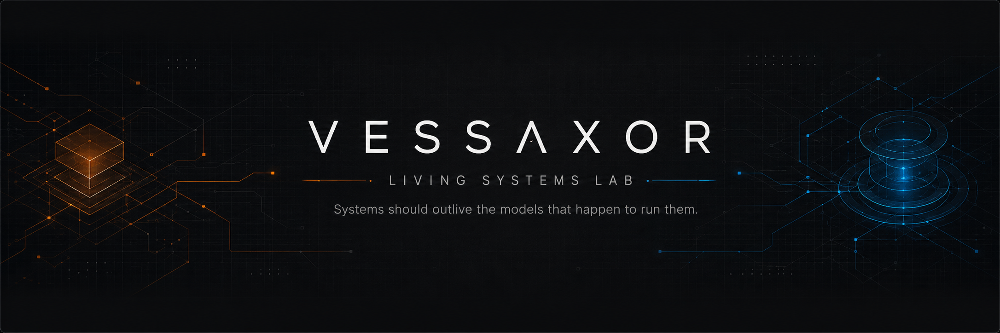

  

### Persistent AI systems · governed orchestration · evidence-bearing autonomy

Building public AI systems where **models remain replaceable, authority stays explicit, execution produces evidence, and continuity survives beyond a single session**.

[**Living Systems Lab**](https://vessaxor-spec.github.io/) ·
[**TEO**](https://github.com/vessaxor-spec/The-ever-evolving-orchestration-) ·
[**GroX**](https://github.com/vessaxor-spec/GroX)

`AI SYSTEMS` · `ORCHESTRATION` · `PERSISTENCE` · `VERIFICATION` · `GOVERNED AUTONOMY`

---

## Flagship Systems

<table>
<tr>
<td width="50%" valign="top">

### [The Ever-Evolving Orchestration](https://github.com/vessaxor-spec/The-ever-evolving-orchestration-)

**Vendor-neutral orchestration specification**

A runnable reference control plane for deciding **which intelligence should do the work, under what authority, with which fallback, and with what verification**.

<!-- AUTO:TEO_META:START -->
[`v1.0.0`](https://github.com/vessaxor-spec/The-ever-evolving-orchestration-/releases/tag/v1.0.0) · `reference_operational`
<!-- AUTO:TEO_META:END -->

**Responsibility → capability → implementation → verification**

</td>
<td width="50%" valign="top">

### [GroX](https://github.com/vessaxor-spec/GroX)

**Persistent AI command environment**

An independent Vessel for translating **Commander intent into bounded Missions, durable execution, attributable evidence, independent verification, and recoverable continuity**.

<!-- AUTO:GROX_META:START -->
[`v0.8.0`](https://github.com/vessaxor-spec/GroX/releases/tag/v0.8.0) · `APEX QUALIFIED`
<!-- AUTO:GROX_META:END -->

**Commander → Pilot GorXu → Divisions → Standing Crew**

</td>
</tr>
</table>

---

## Two Systems, Different Jobs

| | TEO | GroX |
|---|---|---|
| Primary concern | orchestration architecture | persistent AI command and execution |
| Core question | who or what should do the work, under which controls? | how does Commander intent become durable, bounded action? |
| Governing surfaces | responsibility, capability, risk, routing, fallback, verification | Missions, Mission Orders, Crew, tools, state, evidence, recovery |
| Continuity | provider and model independence | source, cognitive, and operational continuity |
| Evidence boundary | evidence-aware finalization and independent verification | attributable execution evidence and independent verification |

TEO and GroX are **independent public systems**. They share a design discipline around bounded authority, verification, evidence, and replaceable intelligence, but neither is presented here as a command layer inside the other.

---

## Current Work

<!-- AUTO:NOW:START -->
Curated public focus · reviewed 17 Aug 2026

- **TEO:** Evidence-governed live execution expansion, with provider-backed controlled documentation replay evidence as the next gate.
- **GroX:** Post-Apex Evolution Program 001 is integrated and v0.8.0 is published; future evolution must preserve the qualified Apex invariants rather than inherit them automatically.
- **Research:** Persistent continuity, bounded authority, evidence-bearing execution, and verification as system properties rather than model features.
<!-- AUTO:NOW:END -->

---

## What I Am Exploring

<table>
<tr>
<td width="33%" valign="top">

### Persistent Intelligence

How useful AI systems retain continuity across sessions, runtimes, models, and infrastructure without confusing remembered state with authoritative truth.

</td>
<td width="33%" valign="top">

### Governed Autonomy

How agents gain meaningful operational independence while authority, escalation, reversibility, and human sovereignty remain explicit.

</td>
<td width="33%" valign="top">

### Verifiable Evolution

How systems improve routing, memory, tools, and reasoning without silently widening power or inheriting trust they have not re-earned.

</td>
</tr>
</table>

---

## Design Discipline

| Principle | What it means in practice |
|---|---|
| **The model is not the architecture.** | Intelligence should be replaceable without making the surrounding system disposable. |
| **Competence does not imply authority.** | Knowing how to act does not grant permission to act. |
| **Evidence before confidence.** | Plausibility matters; observable proof matters more. |
| **Failure must not widen power.** | Fallback, retry, recovery, and replanning must preserve authority boundaries. |
| **Continuity is infrastructure.** | State, memory, recovery, and provenance should survive beyond a single model session. |
| **Evolution must re-earn trust.** | More capable systems should not silently become less governed. |

---

### Systems should outlive the models that happen to run them.

[**Explore the portfolio**](https://vessaxor-spec.github.io/) ·
[**Open TEO**](https://github.com/vessaxor-spec/The-ever-evolving-orchestration-) ·
[**Open GroX**](https://github.com/vessaxor-spec/GroX)

